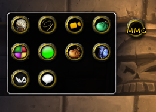
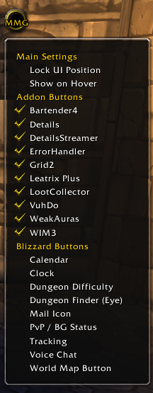

# MiniMapGrabber

**MiniMapGrabber** is a lightweight utility for WoW 3.3.5 to grab minimap buttons(addons or default) and hide them into a Menu(single minimap button you can left-click to show)

### install
[Click here to download](https://github.com/JonasAlv/MiniMapGrabber/archive/refs/heads/main.zip)
Extract and rename **MiniMapGrabber-main** to **"MiniMapGrabber"** then copy to your WoW's addon folder
### Commands
* **`/mmg reset`** – reset to the default position.
* **Left-Click** – Toggles the menu open or closed.
* **Right-Click** – Opens the configuration menu to lock the UI or select which buttons to grab/ignore.
* **Drag** – Move the MMG button on your screen (clamped to prevent leaving the game window).

### To-Do
* simplify addon names for the menu
* find bugs?
